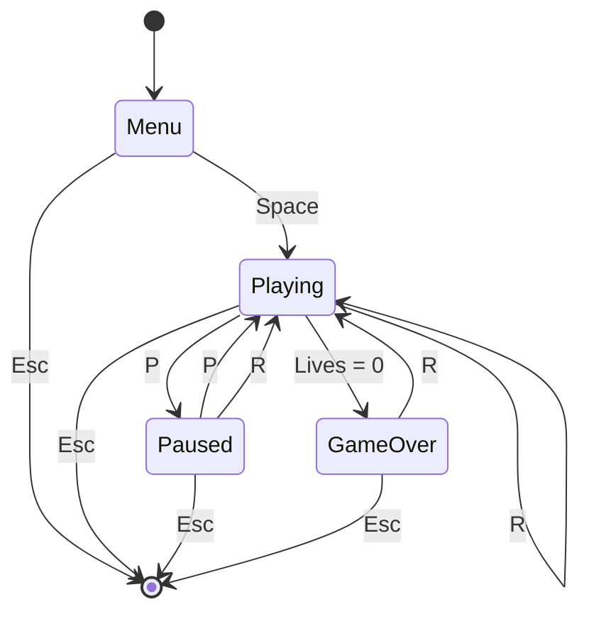

# Fish Eating Game

<p align="center">
  <strong>A colorful 2D arcade survival game built from scratch with C++ and OpenGL/GLUT.</strong>
</p>

<p align="center">
  Eat smaller fish, avoid dangerous predators, grow through five difficulty levels, and survive for the highest score.
</p>

<p align="center">
  
  
  
  
</p>

---

## Overview

**Fish Eating Game** is a single-player 2D arcade game developed in C++ using the classic OpenGL immediate-mode API and GLUT. The player controls an orange fish inside an animated underwater world. Smaller, colorful fish are safe to eat and award points; larger purple fish are enemies that remove lives on contact.

The game becomes progressively harder as the score increases. Across five levels, the player grows larger while fish speeds, enemy sizes, and enemy spawn probability increase. The project demonstrates real-time rendering, event-driven input, frame-rate-independent motion, collision detection, game-state management, procedural animation, particle effects, and configurable difficulty—all in one self-contained source file with no external art assets.

## Gameplay

The objective is simple: **eat, grow, avoid, and survive**.

1. Move the player fish with the arrow keys.
2. Collide with smaller, colorful food fish to earn **5 points**.
3. Avoid the larger purple enemy fish.
4. Progress through five increasingly difficult levels.
5. Survive with three lives and try to set a new best score.

The game ends when all lives are lost. The best score remains available during the current program session.

## Key Features

- **Five-level progression system** driven by the player's score
- **Dynamic difficulty scaling** for fish speed, enemy size, and enemy probability
- **Smooth, delta-time-based movement** with velocity interpolation
- **Continuous key-state input** for responsive multidirectional control
- **Procedural fish spawning** from both sides of the screen
- **Animated swimming paths** using independent sine-wave motion
- **Distance-based collision detection** with configurable sensitivity
- **Food and enemy classification** based on fish type and size
- **Three-life survival system** with temporary post-hit invincibility
- **Particle bursts** for eating, taking damage, and leveling up
- **Damage feedback** through screen shake and player blinking
- **Animated underwater environment** with bubbles, light rays, plants, coral, rocks, and sand
- **Complete user interface** with score, best score, lives, level, size, and progress bar
- **Menu, playing, paused, and game-over states**
- **Fully procedural graphics**—no textures, sprites, or external media files required
- **Centralized configuration** for easy balancing and customization

## Controls

| Key | Action |
|---|---|
| `↑` `↓` `←` `→` | Move the player fish |
| `Space` | Start the game from the menu |
| `P` | Pause or resume gameplay |
| `R` | Restart the game from any screen |
| `Esc` | Exit the application |

> The on-screen buttons are visual interface elements. Game actions are controlled with the keyboard.

## Level Progression

Each level changes the player's size and raises the challenge. Fish receive small randomized speed variations in addition to the base values shown below.

| Level | Minimum Score | Player Size | Food Base Speed | Enemy Base Speed | Enemy Spawn Chance |
|:---:|---:|---:|---:|---:|---:|
| 1 | 0 | 30 | 70 | 100 | 30% |
| 2 | 100 | 35 | 140 | 200 | 40% |
| 3 | 201 | 40 | 210 | 300 | 50% |
| 4 | 301 | 45 | 280 | 400 | 60% |
| 5 | 400 | 50 | 350 | 500 | 70% |

When a new level is reached, the player smoothly grows toward the new size, a gold particle burst appears, and half of the active fish are refreshed so the new difficulty becomes visible immediately.

## How the Game Works

### Game loop

GLUT runs a timer callback approximately every 16 milliseconds, targeting about 60 updates per second. Each callback calculates the elapsed time since the previous frame and caps it at 0.05 seconds to prevent large movement jumps after lag or window interruptions.

During active gameplay, every frame performs the following work:

1. Update global animation time, bubbles, and particles.
2. Calculate the current level from the score.
3. Smoothly update the player's size and velocity.
4. Move every fish and apply its wave animation.
5. Respawn fish that leave the visible area.
6. Detect and resolve player–fish collisions.
7. Render the scene in layers and swap the double buffers.

### Fish behavior

The game maintains a fixed pool of 13 fish. Whenever a fish is created or recycled, the game randomly determines whether it is food or an enemy according to the current level.

- **Food fish** receive one of six bright colors, stay smaller than the player, and award 5 points when eaten.
- **Enemy fish** are purple, larger than the player, faster at higher levels, and remove one life on contact.
- Every fish randomly chooses a travel direction, vertical position, wave phase, wave height, size, and speed variation.
- Off-screen fish are recycled instead of dynamically allocated, keeping runtime behavior simple and predictable.

### Collision and damage

Collision is detected by comparing the Euclidean distance between the centers of the player and another fish. The collision radius is calculated from both fish sizes:

```text
collision range = (player size + fish size) × 0.68
```

A non-enemy fish is edible only when its size is at most 82% of the player's current size. Touching any non-edible fish follows the damage path. After an enemy hit, the player receives 1.35 seconds of invincibility, preventing one overlap from consuming multiple lives.

### Rendering

All visuals are constructed at runtime with reusable OpenGL primitives:

- triangle fans for circles and ellipses
- line loops for outlines
- triangles and quads for fish parts, gradients, scenery, and interface elements
- GLUT bitmap fonts for text
- alpha blending for transparency, highlights, shadows, overlays, and particles

The scene uses an orthographic `1280 × 720` coordinate system and double buffering for smooth animation.

## Technical Design

The source is organized into clearly separated systems:

| System | Responsibility |
|---|---|
| Configuration | Window, object counts, timing, scoring, movement, and player settings |
| Level data | Score thresholds, sizes, speeds, and enemy probabilities |
| Data structures | `Vec2`, `Color`, `Player`, `Fish`, `Bubble`, and `Particle` |
| State machine | Menu, playing, paused, and game-over screens |
| Drawing utilities | Text, circles, ellipses, rounded rectangles, hearts, and buttons |
| Environment | Ocean gradient, light rays, seabed, plants, coral, rocks, and bubbles |
| Effects | Fixed-size particle pool, player blink, and damage shake |
| Fish system | Creation, randomized attributes, movement, recycling, and rendering |
| Gameplay | Input, scoring, lives, collision handling, growth, and difficulty progression |
| GLUT integration | Display, timer, keyboard callbacks, OpenGL setup, and application startup |

### Game-state flow



## Requirements

- A C++ compiler with C++11 or newer support
- OpenGL development libraries
- GLUT or FreeGLUT development libraries

The project only includes standard C++ headers and `<GL/glut.h>`; no third-party game engine is used.

## Build and Run

First, place the source code in a file such as `main.cpp`.

### Ubuntu / Debian

Install the compiler and FreeGLUT development package:

```bash
sudo apt update
sudo apt install build-essential freeglut3-dev
```

Compile and run:

```bash
g++ main.cpp -std=c++17 -O2 -Wall -Wextra -o fish-eating-game -lglut -lGLU -lGL
./fish-eating-game
```

### Windows — MinGW / MSYS2

Install a MinGW-w64 compiler and FreeGLUT, then compile with:

```bash
g++ main.cpp -std=c++17 -O2 -Wall -Wextra -o fish-eating-game.exe -lfreeglut -lopengl32 -lglu32
```

Run:

```bash
./fish-eating-game.exe
```

Depending on the FreeGLUT installation, `freeglut.dll` may need to be beside the executable or available on the system `PATH`.

### macOS

Install FreeGLUT with Homebrew:

```bash
brew install freeglut
```

Because package locations vary between Intel and Apple Silicon systems, use `pkg-config` to supply the correct flags:

```bash
g++ main.cpp -std=c++17 -O2 -Wall -Wextra -o fish-eating-game $(pkg-config --cflags --libs glut)
./fish-eating-game
```

> On some platforms, the compiler command may require small library-path adjustments based on how OpenGL and FreeGLUT were installed.

## Project Structure

The current implementation is intentionally compact:

```text
fish-eating-game/
├── main.cpp       # Complete game source code
└── README.md      # Project documentation
```

## Configuration and Customization

Most core settings are centralized near the beginning of the source, making the game easy to rebalance:

```cpp
const int WINDOW_WIDTH = 1280;
const int WINDOW_HEIGHT = 720;
const int TOTAL_FISH = 13;
const int TOTAL_BUBBLES = 45;
const int MAX_PARTICLES = 150;
const int SCORE_PER_FOOD_FISH = 5;
const int PLAYER_START_LIVES = 3;
const float PLAYER_MOVE_SPEED = 255.0f;
```

The level arrays can be edited to change:

- score thresholds
- player growth
- food and enemy speed
- enemy size ranges
- enemy spawn probabilities

When changing `MAX_LEVEL`, update every level-dependent array so their indices remain consistent.

## Engineering Highlights

This project demonstrates several foundational game-development techniques without relying on a game engine:

- **Frame-rate independence:** movement is multiplied by measured delta time.
- **Stable timing:** large delta-time values are capped to avoid simulation jumps.
- **Input-state tracking:** key press and release callbacks support fluid continuous movement.
- **Object pooling:** fish and particle arrays are reused rather than repeatedly allocated.
- **State-driven architecture:** update and rendering behavior depend on an explicit game state.
- **Layered rendering:** the scene is composed in a deliberate back-to-front order.
- **Data-driven balancing:** level behavior is defined through centralized lookup arrays.
- **Visual feedback:** particles, blinking, screen shake, and HUD changes communicate game events.
- **Separation of concerns:** initialization, update logic, collision handling, rendering, and input are divided into focused functions.

## Current Scope

The game is a keyboard-controlled desktop application. The current version does not include audio, mouse-driven buttons, persistent high-score storage, texture assets, or online features. Keeping the scope focused makes the project easy to study, build, modify, and extend.

## Possible Future Improvements

- Save the best score to a local file
- Add sound effects and background music
- Make menu buttons clickable with mouse input
- Add power-ups, shields, and special fish types
- Introduce a dedicated victory screen or endless mode
- Add selectable difficulty modes
- Add sprite or shader-based rendering
- Separate systems into headers and implementation files
- Add CMake support for cross-platform builds
- Add automated tests for level, scoring, and collision rules

## Learning Outcomes

Building this project provided practical experience with:

- C++ structures, arrays, enums, functions, references, and global game state
- OpenGL coordinate systems and immediate-mode rendering
- GLUT window creation, callback registration, keyboard input, and timing
- Real-time update/render loops
- 2D vector movement and distance calculations
- Procedural animation with trigonometric functions
- Collision detection and gameplay rule design
- UI composition, visual hierarchy, and feedback effects
- Difficulty balancing and maintainable configuration design

## Contributing

Suggestions, bug reports, and improvements are welcome. If you would like to contribute:

1. Fork the repository.
2. Create a feature branch.
3. Make and test your changes.
4. Commit with a clear message.
5. Open a pull request describing the improvement.

## License

No license has been selected yet. If this repository is intended for public reuse or collaboration, add a `LICENSE` file and update this section with the chosen license.

## Author

Developed as a C++ and OpenGL game-programming project.
Tamjid Niloy
CSE Department
AIUB

---

<p align="center">
  <strong>Eat small. Grow strong. Survive the ocean.</strong>
</p>
